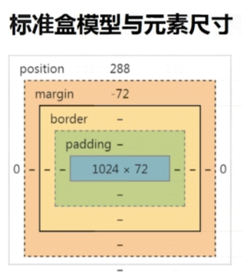
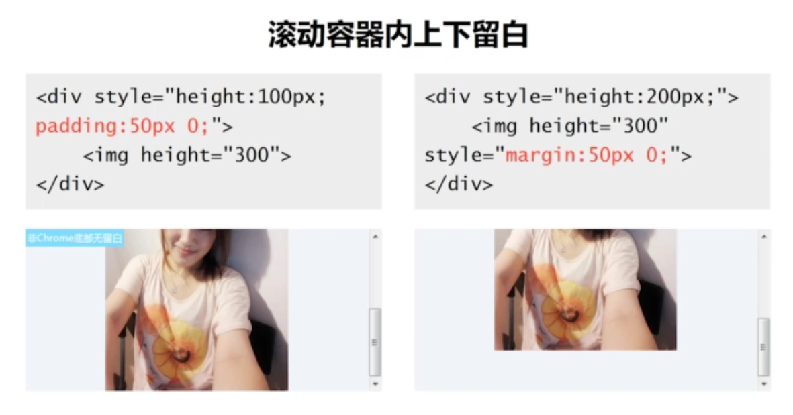

## 深入理解 margin

### margin 与容器尺寸

标准盒模型与元素尺寸



元素尺寸：

- 可视尺寸： clientWidth(标准)
- 占据尺寸： outerWidth

#### margin 与可视尺寸

1. 适用于没有设定 width / height 的普通 block 水平元素；
2. 只适用于水平方向尺寸（即 margin 只会修改水平方向尺寸）

`margin: 50px;`


`margin: 50px -50px;`


`margin: 30px 100px;`


应用场景：

- 一侧定宽的自适应布局

```

<p>图片左浮动...</p>
```


对 `<p></p>` 加一个 `margin` 属性，可以达到一侧定宽的效果。

```

<p style="margin-left: 180px">图片左浮动...</p>
```


#### margin 与占据尺寸（元素占据的空间）

1. block / inline-block 水平元素均适用；
2. 与有没有设定 width / height 值无关；
3. 适用于水平方向和垂直方向

`margin-bottom: 0;`


`margin-bottom: -50px;`


`margin-bottom: 50px;`


应用场景：

- 滚动容器上下留白



注：此处 `padding` 只有在chrome 浏览器中才能实现上下留白，其他浏览器只能用 `margin` 来实现。

- 等高布局


## margin 与百分比单位


应用场景：

- 宽高 2:1 自适应矩形

```css
.box {
    background-color: olive;
    overflow: hidden;
}

.box > div {
    margin: 50%;
}
```


