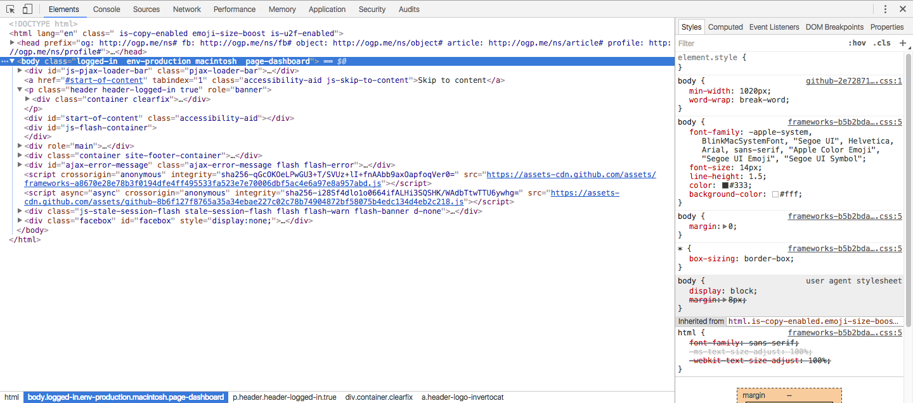

Elements 面板主要用于对页面 HTML 和 CSS 的检查以及可视化编辑。

这是我的 Github 首页的 Elements 面板：

可以看到整个面板被分成 3 个部分，左上是一棵 DOM 数，左下是选中元素的所有父节点，右边是选中元素的样式。左下的部分比较简单，不做详细说明。

## DOM 树

### 检查页面元素

- 右击页面任意一处，选择检查 / 审查元素，查看选中页面对应的 DOM 元素
- 点击 ，当图标显示为蓝色时，鼠标点击页面任意一处，可以查看选中页面对应的 DOM 元素
- 鼠标悬停 DOM 树上的任意一个节点，页面会用淡蓝色的蒙板在页面上标记 DOM 节点对应的页面
- 按键盘的向上向下键可以在展开的节点之间进行切换，向左向右键可以收缩和展开节点

### 编辑 DOM

你可以任意修改 DOM 树上的任意信息，比如修改节点的类型、属性，或者改变 DOM 节点的所属关系等等。不过需要注意的是，这些修改都是临时的，不会得到保存，当刷新页面时所有修改都将重置。

- 双击元素标签，修改 DOM 节点类型，比如将 div 改成 ul
- 双击元素属性，修改 DOM 节点属性，比如修改节点的 id
- 选择一个 DOM 节点，按 enter 键，然后按 tab 键选择想修改的属性或标签
- 选择一个 DOM 节点，并将其拖到目标位置，可以改变页面元素的结构
- 选择一个 DOM 节点，按 delete 键删除

这 5 个是比较常见的操作，操作起来也是直截了当，更多的操作可以通过选中一个 DOM 节点，再右击进行查看：

- Add Attribute：为选中节点添加一个属性
- Edit Attribute：修改选中节点中选中属性
- Edit as HTML：将选中节点当做 HTML 进行编辑
- 复制选中的节点，可以复制选中节点的选择器、XPath、元素本身、outerHTML 等，也能剪切、粘贴节点，我们一般选择复制节点的选择器
- Hide element：隐藏节点
- Delete element：删除节点
- Expand all：展开所选节点下的所有子节点
- Collapse all：收缩所选节点下的所有子节点，包括自己
- 4 个伪类：选中则表示所选节点处于相应的状态，比如选中 `:hover` 则表示所选节点当前正处于鼠标悬停的状态
- Scroll into View：如果所选的 DOM 节点对应的页面元素不在可视区域内的话，点击这个选项则会将页面滚动到可以显示对应的页面元素的位置

## 样式
