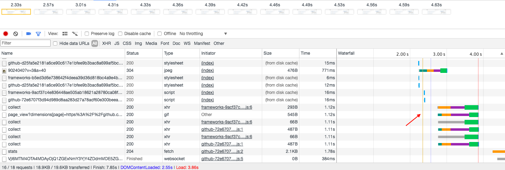

Chrome DevTools 的 Network 面板主要用于度量当前网页的网络性能状况，其记录了当前网页每个网络操作的信息，包括时间数据、HTTP 请求、返回数据等等。

先看 Network 面板长啥样~下面是我 Github 首页的 Network 面板。

Network 面板包含很多小面板，有些是默认隐藏的。其中最主要的一个面板就是控制面板(Control Pane)，即上图中的 "1" 部分，控制面板上有很多的功能按钮。"2" 部分是请求表格(Requests Table)，表格内容按照请求的顺序排序，点击一个请求的 "Name" 列可以查看这个请求的具体信息；在表格的头部，右键可以看到还有很多隐藏的列，比如 Method、Protocol、Domain 等等。"3" 部分是概览(Summary)，主要显示这个网页有多少请求，请求的数据有多大，一共花费了多少时间。

上面是 Network 3 个面板的大概了解，下面就对面板 "1"、"2" 进行重点介绍。

## Control 面板

### 开始/停止记录

 表示正常记录网络的请求状况，点击，当图标变成  时，代表停止记录请求状况。

### 清除记录

点击  可以清除请求表格内的内容。

### 截取加载的瞬间

点击  ，当图标变成  时，代表开启截屏模式，即截取网页在加载过程中的瞬间，这些瞬间显示了网页在什么时间加载出了哪些部分。以我的 Github 首页为例，打开截屏功能后，出现下面的结果：

在控制面板下面出现了一块新的面板，用来显示网页加载过程中的截屏。当鼠标悬浮在一张截图上时，下面的请求表格面板上出现了这张截图加载时的时间；点击一张截图时，请求表格面板也会显示相应时间内加载的资源及其信息；双击一张截图，可以查看这张截图的大图，可通过左右键进行切换。
