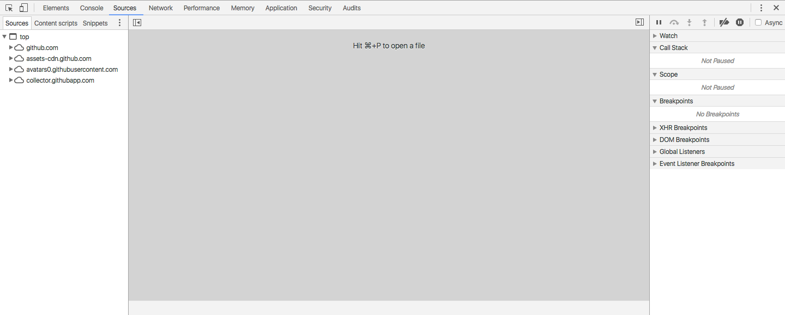

先看我的 Github 首页的 Sources 面板：

## 熟悉 Sources 面板

先来认识一下 Sources 面板。可以看到面板被分为左中右三个部分，左边是文件导航，中间是文件的具体内容，右边可以统称为调试面板。整个面板就像一个 IDE，所以还是挺亲切的。

左边的文件导航面板很好理解，展示了网页所用到的所有文件。

中间有 3 点需要提一下，其他的操作都比较显而易见。另外需要提一下的是打开文件，可以用快捷键 Cmd + p / Ctrl + p 来在任何一个功能面板上打开一个文件。

标记 1、2 处可以隐藏/展开左右两个面板，标记 3 处格式化代码，当代码被压缩时尤其有用。

右边的调试面板比较复杂，需要借助调试的例子来解释作用。

## 调试技巧

本文用到的测试代码为自己所写。

### 添加断点

打开一个文件，中间的面板中显示了代码，代码的左侧有代码行号，代码行号所在的位置叫做行号槽，点击行号槽，为相应的行添加断点，并在相应的行号上面加上一个类似肩章的五边形图标。特别提一下的是，这个图标的颜色是蓝色的。如下：

另外，如果一条语句由多行组成，如果在这条语句的行中添加断点的话，那么断点将会被加到下一条语句。举例如下：

在上面的代码中，你可以在 13 行，但如果你想在 14-17 行添加断点的话，那么断点将会被添加到 19 行。另外，你也不能为空行添加断点，那也会被添加到下一条语句上。比如你想在 18 行添加断点，但实际会被添加到 19 行。

**条件断点**

右键一个没有添加断点的行号，选择 "Add conditional breakpoint"，输入你的条件，当条件满足时，断点才会生效。回车后，效果如下：

可以看见，条件断点跟一般断点的区别就是颜色变成了黄色。

### 断点的其他操作

- 忽略：如果你想暂时忽略某个断点，右键断点，选择 "Disable breakpoint"
- 修改：修改断点生效的条件。你可以将一个非条件断点通过这个方式修改成条件断点，也可以将条件断点变成非条件断点
- 删除：你可以直接点击断点，或者右键 "Remove breakpoint"

### 黑盒脚本

右键行号槽的时候，第一个选项总是："Blackbox Script"。

那什么是黑盒脚本呢？

我们写项目时，很多时候是要引用第三方库或框架的，当我们调试时，调试的对象应该是我们自己写的代码，但很多时候，我们经常在焦灼地进行下一步下一步时，突然代码跳到了第三方库或框架的源码上去，这让我们焦灼的内心更添了一把柴火。黑盒脚本就是用来解决这个问题的。它能够将一个 js 文件标记为 "Blackbox Script"，那么我们就**永远**不可能进入这个文件内部，这个文件对我们来讲就是一个黑盒子。为什么要强调“永远”呢？因为不仅普通的断点不能访问这个被标记了的脚本，其他的，比如说 DOM 断点、事件断点等等都无法访问那个脚本文件内部。
